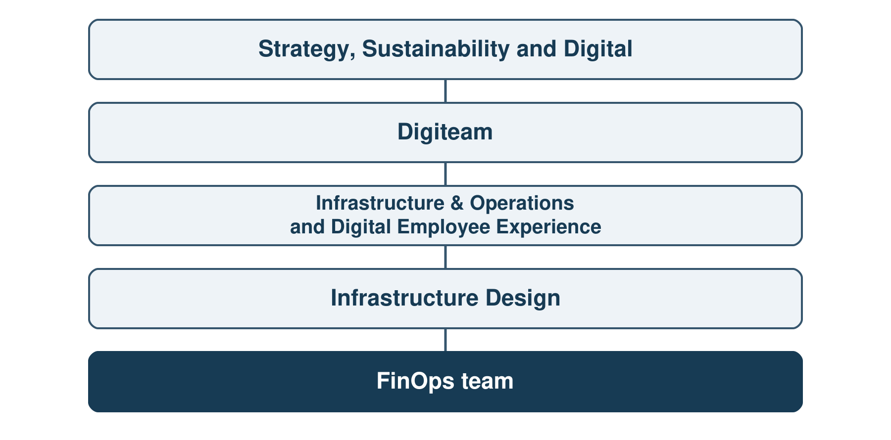

# 1.1 — Professional Context and the FinOps Team

Technip Energies France is the host organization for this project. It belongs to Technip Energies, an engineering and technology group active in project delivery and technology, products and services for the energy sector. At group level, Technip Energies reported revenue of EUR 7.2 billion in 2025 and more than 18,000 employees across 35 countries; these figures do not describe the French entity alone (Technip Energies, 2026b).

Within Technip Energies, Digiteam is part of Strategy, Sustainability and Digital. Infrastructure Design sits within Digiteam's Infrastructure & Operations and Digital Employee Experience branch. According to the author's account, the FinOps team is attached to Infrastructure Design. The team has a manager and a FinOps expert, and works with a Data Engineering consultant based in Morocco and a Power BI consultant based in India. The author works in the team as a FinOps Engineer and reports to its manager. These roles bring together knowledge of cloud spending, data preparation and reporting, but a change to a measure or a visual can require coordination across them.

Figure 1.1 — Organizational context of the FinOps team. Source: author's simplified adaptation of internal organizational information dated August 2026; FinOps placement follows the author's professional account. Individual names and unrelated branches are omitted.

FinOps connects technology usage and cost with financial accountability and decisions shared by engineering, finance and business stakeholders (FinOps Foundation, n.d.-c). In this team, cloud consumption data supports analysis of spending, allocation and potential optimization. Cloud Showback is a central reporting product intended to make costs understandable to those responsible for applications and domains, without treating every cost difference as a realized saving. Its usefulness depends on the data and calculations behind the visual interface as much as on the interface itself. Chapter 2 defines the FinOps concepts and cost measures used in this study.
